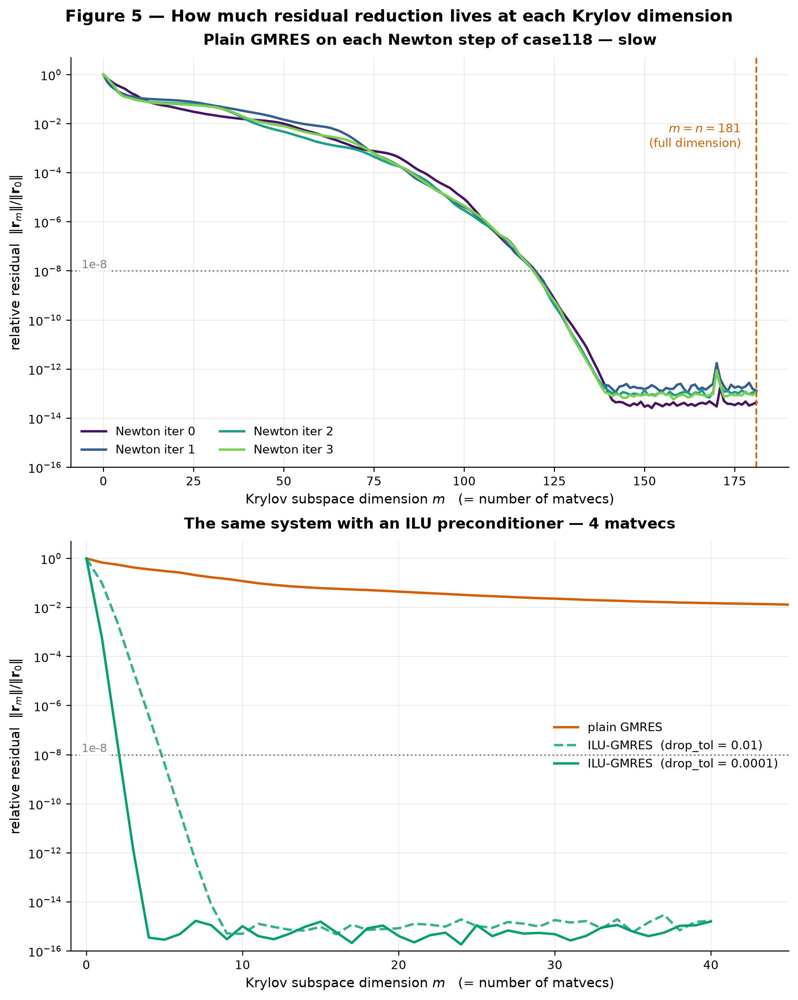
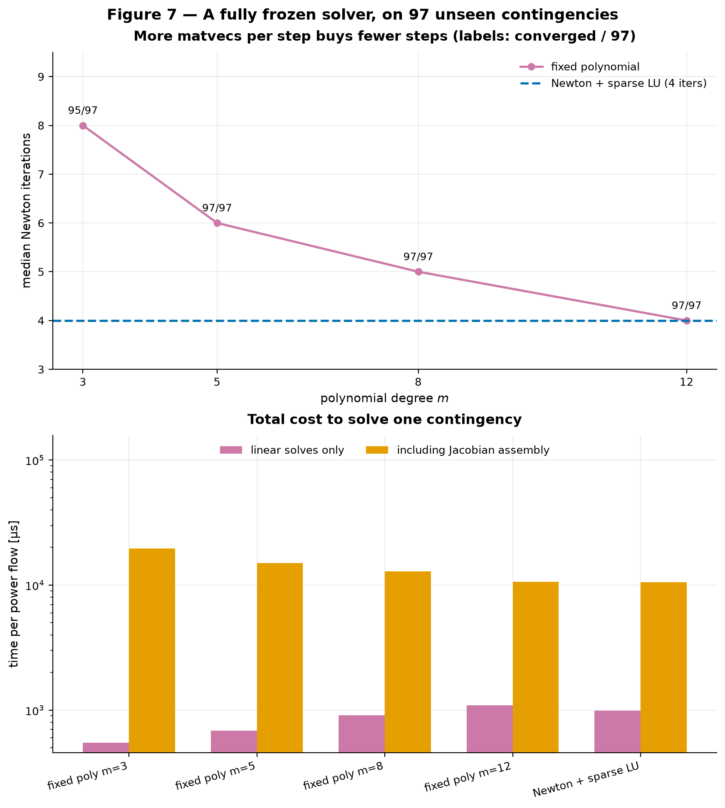
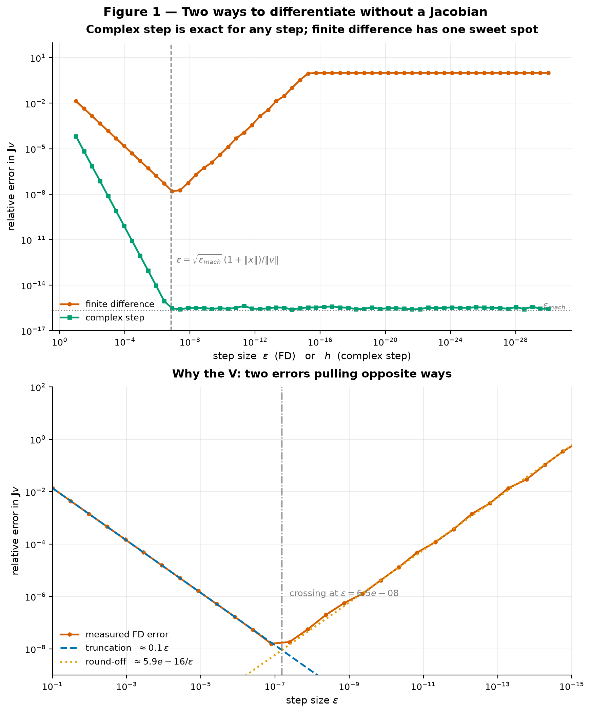
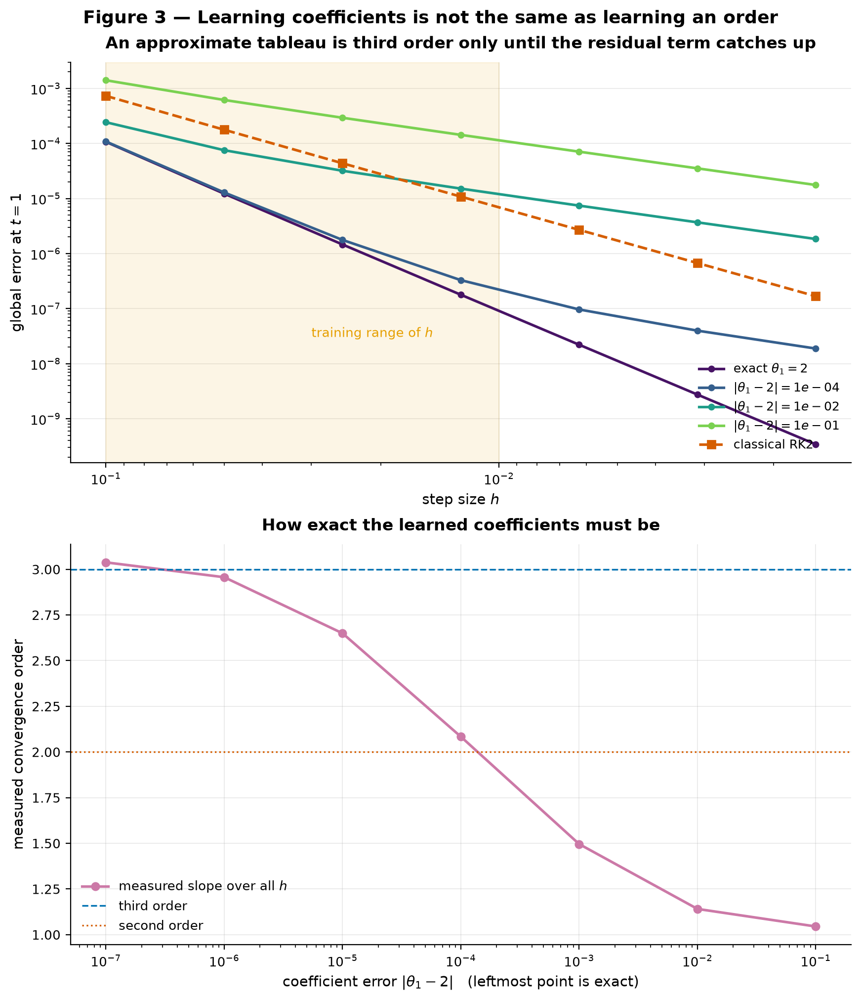
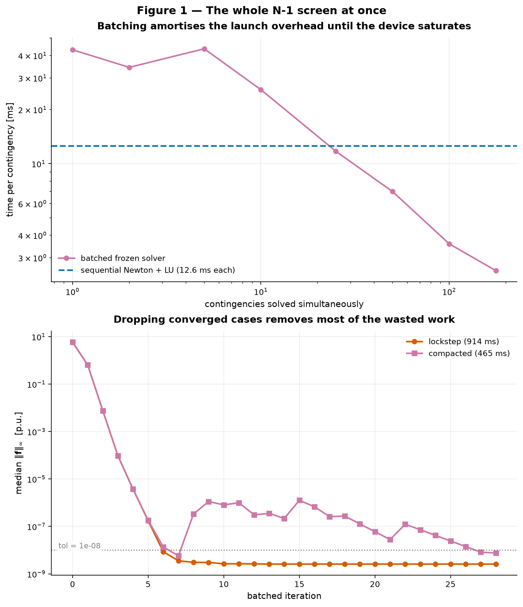

# Learned Iterative Solvers for AC Power Flow

Learning tailored iterative algorithms for AC power flow — from Newton–Raphson to Krylov
to learned solvers, one notebook at a time.

This is a **learning repository**. The goal is not a benchmark win; it is to understand,
from first principles and with honest numbers, what it means to *learn a solver* rather
than *learn a solution*.

---

## The question

Solving an AC power flow means finding the bus voltage angles and magnitudes
$x = [\boldsymbol{\theta}, |\mathbf{V}|]$ that zero the power mismatch:

$$\mathbf{f}(x) = \mathbf{S}^{\text{inj}}(x) - \mathbf{S}^{\text{spec}} = \mathbf{0}$$

Newton–Raphson does this by repeatedly forming the Jacobian $\mathbf{J}$ and solving
$\mathbf{J}\,\Delta x = -\mathbf{f}(x)$ by sparse LU. It works, and it converges
quadratically in 3–5 iterations. So why change anything?

Because in practice you rarely solve *one* power flow. Contingency screening on a
2000-bus grid means thousands of power flows that are all *nearly the same problem* —
same network, same loading, one branch removed. A classical solver throws away
everything it learned from instance $k$ before starting instance $k+1$.

The idea explored here, following [4] and [5], is to keep it: use historical solve data
to learn an iteration that is *tailored* to a family of problems, while still evaluating
the true physical mismatch $\mathbf{f}(x)$ at every step.

## Learn the solver, not the solution

|  | Direct prediction (e.g. DNN-OPF) | Learned iterative algorithm |
|---|---|---|
| Network outputs | the **solution** $\hat{x}$ | the **update rule** $\Delta x$ |
| Physics evaluated at runtime | no | yes — true mismatch every iteration |
| Error known online | no | yes, it *is* the mismatch |
| A bad network gives you | a wrong answer, silently | a slower answer, still correct |
| Accuracy ceiling | network quality | machine precision |

The second column can be safeguarded: if a learned step fails to reduce
$\lVert\mathbf{f}\rVert$, fall back to a Newton step. The worst case degrades to Newton.

## Roadmap

Each milestone is a self-contained notebook with figures and a plain-language reading.

| # | Notebook | Content | Status |
|---|---|---|---|
| 01 | [`01_newton_and_krylov.ipynb`](notebooks/01_newton_and_krylov.ipynb) | AC power flow Newton–Raphson from scratch, validated against pandapower. Then the linear subproblem $\mathbf{J}\Delta x = -\mathbf{f}$ three ways: sparse LU, GMRES, preconditioned GMRES. | **done** |
| 02 | [`02_does_the_family_share_structure.ipynb`](notebooks/02_does_the_family_share_structure.ipynb) | Does a family of power flows share enough structure to learn from? Where the variation lives, what object can be frozen, preconditioner reuse across N-1, and a fully fixed solver tested end-to-end on unseen contingencies. | **done** |
| 03 | [`03_jacobian_free.ipynb`](notebooks/03_jacobian_free.ipynb) | Jacobian-free: take $\mathbf{J}v$ from a directional derivative of the residual and drop matrix assembly entirely. Finite difference vs. the exact complex-step derivative, and where each one's limits bite. | **done** |
| 04 | [`04_learning_the_butcher_tableau.ipynb`](notebooks/04_learning_the_butcher_tableau.ipynb) | The Runge–Kutta neural network [4] reproduced on ODEs, where answers are known in closed form. Learnable *inner* coefficients, a two-stage method reaching third order, and what "learning an order" does and does not mean. | **done** |
| 05 | [`05_r2n2.ipynb`](notebooks/05_r2n2.ipynb) | R2N2 [5] on power flow. Why learned inner coefficients *provably cannot* help the linear subproblem, and only reach parity on the nonlinear residual. | **done** |
| 06 | [`06_where_it_breaks.ipynb`](notebooks/06_where_it_breaks.ipynb) | Trying to break the frozen solver: load scaling to the loadability limit, combined stress, $N-k$ outages. The safeguard that nearly did not work. | **done** |
| 07 | [`07_batched_gpu_screening.ipynb`](notebooks/07_batched_gpu_screening.ipynb) | The whole N-1 screen as a single batched GPU solve — what removing the Jacobian finally buys. | **done** |


## Findings so far

**Notebook 01.** Validated a from-scratch AC power flow against pandapower to machine
precision on six cases, then measured the linear subproblem honestly:

- Newton converges in **4–5 iterations** from a flat start on every case from 9 to 300
  buses, with measured quadratic order. There is no room to win on outer iterations.
- The linear solve does **not** dominate at small sizes — on `case118` it is ~10% of a
  Newton iteration. Its share crosses 50% only near $n \approx 2400$ and reaches ~65% on
  `case2869pegase`. (The crossover is implementation-dependent; the scaling is not.)
- Plain GMRES needs $m = 120$ of $n = 181$ Krylov dimensions to reach $10^{-8}$ on
  `case118` — **2.2× slower** than the sparse LU it was meant to replace.
- ILU-preconditioned GMRES converges in **~4 matvecs**, but building the ILU costs
  **1.13× a full LU solve**, so rebuilt per system it is *also* slower than LU.
- **On a single power flow, nothing beats sparse LU.** Any speed-up must come from
  amortizing work across many related systems — which is precisely the premise of
  learning a solver, and precisely the regime contingency analysis lives in.



**Notebook 02.** Sampled a family from `case118` — load/dispatch perturbations and all 177
non-islanding N-1 outages — and asked whether it shares enough structure to learn from:

- **$\mathbf{J} = \mathbf{J}(\mathbf{V}, \mathbf{Y}_{bus})$ — the Jacobian does not depend
  on the injections.** Under load variation at a fixed state it is *bit-identical*; a
  branch outage moves it 10–100× more. Topology, not loading, is the interesting axis.
- **A reused preconditioner transfers.** One ILU factored from the intact grid conditions
  every contingency Jacobian ($\kappa_2: 3000 \to \approx 1$), even for outages that move
  $\mathbf{J}$ by 30%.
- **A single frozen coefficient vector cannot match per-instance refitting** — it plateaus
  around $2\times10^{-4}$ against the oracle's $6\times10^{-11}$, and stops responding to
  degree past $m\approx4$.
- **Training on the wrong distribution cost 0/97 convergence.** Fitting only on flat-start
  systems failed completely; fitting over the states Newton actually visits gave 97/97.
- **End to end: it works, but is not yet faster.** A fully frozen solver — one
  preconditioner, one coefficient vector, zero runtime adaptation — converges all 97 unseen
  contingencies in the same 4 Newton iterations as sparse LU at $m=12$. Cheaper linear
  solves buy extra Newton steps, and each of those pays for a Jacobian assembly.



**Notebook 03.** The frozen solver never needs $\mathbf{J}$ as a matrix — only the product
$\mathbf{J}v$, which is a directional derivative of the residual:

- Assembling $\mathbf{J}$ costs **~100× a residual evaluation**, so replacing the product
  with a derivative deletes the dominant cost outright.
- The **finite-difference** matvec costs one residual and gives ~8 correct digits, with its
  optimum at $\varepsilon\sim\sqrt{\epsilon_{mach}}$ where truncation meets round-off.
- The **complex-step** matvec is exact to $3\times10^{-16}$ for *any* $h$ below $10^{-8}$,
  because it never subtracts nearly equal numbers. It needs a residual free of `conj`/`abs`
  — the real polar form, validated against the complex form to $10^{-13}$.
- **97/97 held-out contingencies converge** for every $m\ge5$, matrix-free.
- **The finite-difference accuracy ceiling is real.** Through $m=8$ the two matvecs are
  indistinguishable; at $m=12$ complex step reaches the sparse-LU baseline of 4 iterations
  while finite difference stalls at 6.
- Measured ~5–6× faster per power flow than matrix-based Newton — **conditional on our slow
  assembly**. Break-even is around 140 µs of assembly, roughly half a sparse LU solve.



**Notebook 04.** Notebook 02's monomial basis died at $m\approx5$ because the *inner*
recurrence was fixed to $\mathbf{A}^j\mathbf{b}$. The Runge–Kutta neural network of [4] is
the smallest instance of the fix — learn the Butcher tableau — and on ODEs every claim can
be checked against closed-form answers:

- **A two-stage method reaches third order**, breaking the general $p\le m$ barrier, via the
  unique analytic tableau $(\theta_1,\theta_{c1},\theta_{c2})=(2,\,0.75,\,0.25)$. Measured
  slope 3.04 against 2.01 for classical RK2.
- **Training recovers it to six decimal places** from data alone — but only the Taylor
  regulariser does. The scaled MSE term of [4] is heavy-tailed here (the ratio scales like
  $h^{-2}$, spanning eight orders of magnitude within a batch) and *annihilates* the
  regulariser: adding it changed the learned coefficients by nothing at all.
- **Order is exact cancellation, not small error.** $|\theta_1-2|=10^{-3}$ still measures
  slope 1.50; third order needs $\sim10^{-5}$. Yet the error at $h=0.1$ barely moves. A
  learned method can look like it has a structural property it does not have, and only
  out-of-distribution testing reveals it.
- **Not reproduced:** [4] reports learned integrators beating classical RK at equal stage
  count. Ours attains the right order with a **5.2× larger error constant** than RK3, and
  three objectives failed to close it. The regulariser fixes the order and says nothing
  about the constant; the term that would tune it is the one we could not optimise.



**Notebook 05.** R2N2 [5] — the architecture the series was building toward — applied to power
flow, with a result the roadmap did not predict:

- **On a linear system the learned inner coefficients provably add nothing.** For
  $f(z)=\mathbf{A}z-b$ the inner recurrence gives $v_j = v_0 + h\mathbf{A}\sum_l \theta_{j,l}v_l$,
  so $\mathrm{span}\{v_j\} = \mathcal{K}_n(\mathbf{A},v_0)$ for *any* $\theta$ — the same
  reachable set as notebook 02's frozen polynomial. They only re-coordinatise it, turning a
  convex least-squares into a non-convex search.
- Measured at equal matvec budget: **R2N2 loses at every budget** to both the frozen polynomial
  and GMRES, by 1.6–2.6×. Training also leaves the basis *worse* conditioned at every $n$.
- **On the nonlinear residual**, where the inner evaluations carry curvature rather than Krylov
  directions, R2N2 reaches **parity** (40 vs 36 residual evaluations to $10^{-8}$) — not
  superiority, and $n=8$ diverged in training.
- Consistent with [5], which presents its linear experiments "not because of the computational
  benefits achievable" and locates the benefits in nonlinear problems.

**Notebook 06.** Tried to break the frozen solver and mostly could not:

- It tracks Newton through load scaling **to the loadability limit** (both fail at
  $\lambda=3.2$), degrading 4 → 9 iterations rather than failing, because preconditioner drift
  is smooth ($\kappa_2(\mathbf{M}^{-1}\mathbf{J})$: 1 → 142).
- Held-out contingencies at 2.8× loading: no separation from Newton at all.
- It breaks only under severe topology damage — at N-25 (23% Jacobian change) Newton solves
  13/40, the unguarded solver 11/40.
- **The obvious safeguard did not help and never fired.** Requiring monotone decrease admits
  arbitrarily slow progress; the failures are *stalls*, not blow-ups, so every stalling step
  passes the test. Requiring a decrease **rate** ($\gamma=0.5$) restores exact parity with
  Newton, at 29% fallback in the hardest regime and 0% where the step is healthy.
- Cost: one residual evaluation, **1.2%** of a matrix-based Newton iteration.

> A monotonicity condition is not a convergence condition — and it fails silently, because
> guarded and unguarded behave identically until you check whether the guard ever triggered.

**Notebook 07.** The whole N-1 screen as one batched GPU solve, which only became possible once
notebook 03 removed the Jacobian:

- All 177 contingencies converge in a single batched solve: **465 ms against 2.23 s** for
  sequential sparse Newton — a **5×** end-to-end speed-up, 80 → 394 contingencies/second.
- **Lockstep is the dominant inefficiency, not the arithmetic.** Median 6 iterations, worst 28;
  run naively everyone pays 28. Compacting converged cases out of the batch halves the total
  (914 → 465 ms) and is possible *only* because no factorisation is pinned to a fixed shape.
- Stated costs: the dense batched residual does **29×** the arithmetic of a sparse one, the
  baseline is single-threaded, and at batch size 1 the GPU is several times *slower* than the
  CPU.



## Where the series ends up

The arc is not the one the roadmap predicted:

1. On a **single** power flow, nothing beats sparse LU.
2. Learning only pays by **amortising across many related problems** — and since
   $\mathbf{J}$ does not depend on the injections at all, **topology** is the axis that matters.
3. A completely frozen solver matches Newton's iteration count on unseen contingencies, but the
   cost is dominated by Jacobian **assembly**.
4. Going **matrix-free** deletes that cost and gives the first genuine speed-up.
5. Learned **inner** coefficients transform Runge–Kutta integrators, **provably cannot** help
   the linear subproblem, and reach only parity on the nonlinear residual.
6. The frozen solver's competence is wide but **bounded**, and only a *rate*-based safeguard
   makes it never worse than Newton.
7. Matrix-free is what makes the whole screen **batchable**.

**The winning method is not the sophisticated one.** A reused ILU, five frozen coefficients,
finite-difference matvecs and a residual check outperform every learned architecture tried here
— and the reason each more elaborate idea failed is measurable and, in the R2N2 case, provable.

## Layout

```
lis/            reusable library code (power flow, Krylov, plotting)
notebooks/      the readable narrative — one per milestone, figures baked in
refs/           papers (gitignored) + bibliography with citation keys [1]–[5]
figures/        exported figures
data/           generated datasets (gitignored)
```

## References

Full bibliography with links: [`refs/README.md`](refs/README.md).
Citation keys `[1]`–`[5]` are used consistently across all notebooks.

## Setup

```bash
pip install -r requirements.txt
```

Python 3.11, PyTorch 2.11 (CUDA 12.8), pandapower 3.5. A GPU is only needed from
notebook 08 onward.
